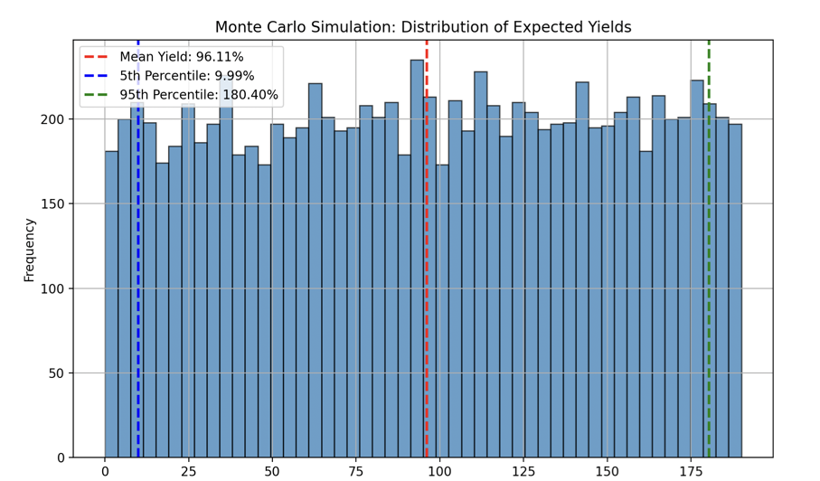

# Monte Carlo Simulation Report

This simulation models flight-delay insurance underwriting using **10,000 trials**, where delay probabilities (`p`) range between **1% and 20%**. The expected yield is calculated as:

\[
\text{Yield} = \frac{M \cdot (\pi - \lambda \cdot p)}{C} \times 100\%
\]

with **π = $20**, **λ = $100**, **M = 10,000** policies, and **C = $100,000** capital. Results show an **average yield of 96.1%**, meaning capital nearly doubles on average. The **5th percentile yield (worst 5% cases) is +10%**, ensuring profitability even in unfavorable conditions, while the **95th percentile yield is +180%**, indicating high upside potential. The histogram confirms a right-skewed distribution, with most outcomes between **50% and 150% yield**. No negative yields suggest low default risk unless **p exceeds 20%**. Risk mitigation strategies include **dynamic pricing (π), increasing capital reserves (C), and real-time probability monitoring (p)** to prevent catastrophic losses. 🚀


# Running Monte Carlo Simulation Locally

## **Step 1: Install Python**
Check if Python is installed:
```sh
python --version
```

## **Step 2: Create Virtual Environment (Optional)**
```sh
python -m venv venv/monte_carlo_env
```
Activate:
- **Windows**:  
  ```sh
  venv\monte_carlo_env\Scripts\activate
  ```
- **Mac/Linux**:  
  ```sh
  source venv/monte_carlo_env/bin/activate
  ```

## **Step 3: Install Dependencies**
```sh
pip install numpy pandas matplotlib
```

## **Step 5: Run the Script**
Navigate to the script directory and execute:
```sh
python monte_carlo_simulation.py
```

---



---

# Flight-Delay Insurance Underwriting: Balancing Risk and Reward  

## Introduction  
In flight-delay insurance underwriting, an investor sells policies to travelers. For each policy:  
- The investor collects a **premium** (denoted as `π`, e.g., $10).  
- If the flight is delayed, the investor pays a **payout** (denoted as `λ`, e.g., $100).  

The probability of delay (`p`) varies between **1% and 20%**, depending on factors like flight routes and weather. This article explains how investors model profitability, adjust pricing, and manage risks.  

---

## Key Formula: Expected Yield  
The investor’s profit (or loss) depends on three variables:  
- `M`: Number of policies sold.  
- `C`: Initial capital (e.g., $100,000).  
- `p`: Probability of delay.  

The **expected yield** (percentage return on capital) is calculated as:  

$$  
\text{Yield} = \frac{M \cdot (π - λ \cdot p)}{C} \times 100\%  
$$  

### Example 1: Base Case  
Assume:  
- `π = $10`, `λ = $100`, `M = 10,000`, `C = $100,000`.  

| Delay Probability (`p`) | Yield       |  
|--------------------------|-------------|  
| 1%                       | **+90%**    |  
| 20%                      | **-100%**   |  

At 1% delay probability, the investor earns a 90% return. At 20%, they lose all capital.  

---

## Break-Even Probability (`p*`)  
The **break-even point** occurs when premiums equal expected payouts:  

$$  
π = λ \cdot p^* \quad ⇒ \quad p^* = \frac{π}{λ}  
$$  

- If the actual delay probability `p < p*`, the investor profits.  
- If `p > p*`, they lose money.  

### Example 2: Adjusting Premiums  
Raising the premium to `π = $20` shifts the break-even point:  

$$  
p^* = \frac{20}{100} = 20\%  
$$  

Now, the investor breaks even even at a 20% delay probability.  

---

## Sensitivity Analysis  

### 1. Increasing Premiums  
Doubling the premium (`π = $20`) dramatically improves yields at low delays:  

| Scenario       | `p`  | Yield  |  
|----------------|------|--------|  
| 1% delay       | 1%   | +190%  |  
| 5% delay       | 5%   | +150%  |  

### 2. Selling More Policies (`M`)  
Scaling policy sales amplifies gains **and** losses:  
- Doubling `M` doubles the numerator in the yield formula.  
- At `p = 20%`, doubling `M` would turn a -100% yield into a -200% loss (if capital allows).  

---

## Risk Management: Monte Carlo Simulations  
Since `p` is uncertain, investors simulate thousands of scenarios:  

1. **Randomize `p`**: Draw `p` uniformly between 1% and 20%.  
2. **Compute Outcomes**: Calculate yield for each trial.  
3. **Analyze Results**:  
   - Mean expected yield.  
   - Volatility (standard deviation).  
   - Worst-case losses (e.g., 5th percentile).  

### Example Simulation Results  
For `π = $20`, `λ = $100`, `M = 10,000`, `C = $100,000`:  
- **Mean Yield**: ~80%  
- **Worst-Case (5th percentile)**: -50%  

---

## Strategic Takeaways  

### 1. Tradeoffs  
- **Higher Premiums (`π`)**: Raise break-even thresholds (`p*`) but attract fewer customers.  
- **Lower Payouts (`λ`)**: Reduce liability but may make policies less appealing.  

### 2. Policy Volume (`M`)  
- Scaling `M` magnifies returns but requires sufficient capital to absorb losses.  

### 3. Capital Buffer (`C`)  
- Larger `C` reduces yield volatility. For example, $1M capital cuts percentage swings by 90% compared to $100k.  

### 4. Tail Risk  
- Even with favorable average conditions, extreme delays (e.g., 20%) can wipe out capital.  

---

## Conclusion  
Flight-delay insurance underwriting hinges on mathematical optimization. While raising premiums or scaling policy sales boosts returns, investors must model **worst-case scenarios** to avoid catastrophic losses. Monte Carlo simulations provide a robust way to:  
- Quantify the distribution of outcomes.  
- Balance profitability with risk tolerance.  


